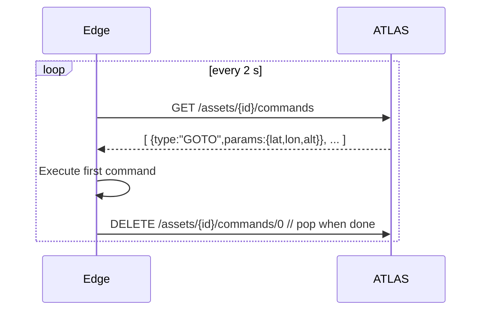

# ATLAS Edge-Agent Integration Guide

> Audience: firmware / robotics developers who are writing code for field devices (drones, fixed cameras, ground sensors) that must report into an **ATLAS Command** instance.
> Scope: API contract, recommended data rates, error handling and provisioning workflow.  Assumes **ATLAS Command** API v1 is reachable at `http://<atlas-host>:8000`.

---

## 1. Device Life-cycle in 90 seconds

| Phase | REST / WS call | Purpose |
|-------|----------------|---------|
| **Bootstrap** | `POST /api/v1/assets` | Creates or updates the *Asset* representing the physical device. |
| **Heartbeat** | `POST /api/v1/assets/{asset_id}/telemetry` *(status-only payload)* | Lets ATLAS know the unit is alive; includes battery, temperature, fw version. |
| **Mission Data** | `POST /api/v1/assets/{asset_id}/telemetry` *(lat/lon/…)* | Streams real-time position and health at ≤2 Hz. |
| **Detections** | `POST /api/v1/contacts` | Publishes vision / RF / acoustic detections. |
| **Command Fetch** | `GET  /api/v1/assets/{asset_id}/commands` | Reads pending commands. |
| **Acknowledge** | `DELETE /api/v1/assets/{asset_id}/commands/{index}` | Removes the executed command. |

> 🔄 **Polling vs WebSockets** – WebSocket push will land in API v2; for now poll `/commands` every 1–2 s.

---

## 2. Registration / Bootstrap

1. Generate a stable **Asset ID** – string, max 30 chars (`DRONE-001`, `CAM_NW_TOWER`).
2. Build the JSON body:

```jsonc
{
  "id": "CAM_NW_TOWER",         // optional – backend generates UUID if omitted
  "name": "North-West Security Cam",
  "asset_model_id": 4,           // see /assets/catalog
  "metadata": {
    "hw_revision": "rev-B",      // free-form – anything useful for ops
    "fw_version": "0.9.2",
    "edge_agent": "atlas-edge 0.1.0"
  }
}
```

3. `POST /api/v1/assets` – a 201/200 indicates success.  Store the returned `asset_id`.

If you re-POST with the same `id`, ATLAS treats it as *upsert* (handy after firmware reflashes).

---

## 3. Telemetry Contract

### 3.1  JSON Schema (excerpt)
```
TelemetryCreate:
  latitude*        float   -90…90
  longitude*       float   -180…180
  altitude         float   metres AMSL
  heading          float   deg TN
  speed            float   m/s
  battery          int     0–100 %
  status           enum    standby|active|error|...
  extra            dict    free-form key/val (temp, signal_rssi…)
```
*`*` = required*

### 3.2  Rate & batching
* ✅ **Recommended** – 1 packet / 500 ms during active flight, 1 packet / 5 s when stationary.
* Batch insert endpoint: `POST /telemetry/batch` with array body (max 500 rows).
* Compression: enable `Content-Encoding: gzip` if link is slow (>200 ms RTT).

---

## 4. Command Queue Pattern



* Empty list ⇒ no work.
* If DELETE fails (network), retry later – commands are idempotent until deleted.

---

## 5. Contact / Detection Uploads

Use when the device's sensors detect an external object.

```json
{
  "id": "CAM001_TARGET_1700000000",
  "spotter_asset_id": "CAM001",
  "contact_description": "human",
  "detection_metrics": {
    "bearing_deg": -45.2,
    "elevation_deg": 1.4,
    "range_m": 82.5,
    "confidence": 0.91
  }
}
```

ATLAS will triangulate if a bearing + range is supplied (see `triangulate_contacts` task).

---

## 6. Error Handling & Retry Strategy

| HTTP | Meaning | Agent Action |
|------|---------|-------------|
| 429  | Rate-limit | Back-off (+jitter) 5 s, halve publish rate |
| 5xx  | Backend issue | Exponential back-off up to 60 s, **don't** drop data – queue to disk if possible |
| 4xx ≠ 429 | Permanent error (bad schema, unknown asset) | Log & raise local alert; do **not** retry unchanged payload |

All error bodies include `error_code`; log it for support.

---

## 7. Provisioning Cheat-Sheet (Raspberry Pi OS Lite)

```bash
# On laptop
curl -LO https://downloads.raspberrypi.org/raspios_lite_arm64_latest
rpi-imager --cli ...
#   enable SSH, set hostname edge-001, Wi-Fi creds

# After first boot (Pi)
ssh pi@edge-001.local <<'SSH'
  git clone https://github.com/YOU/atlas-edge-agent.git
  cd atlas-edge-agent && sudo ./provisioning/first_boot.sh
SSH
```

Within ~4 minutes the device should appear in **ATLAS Web Interface › Asset List**.

---

## 8. Security Notes

* Use **token-auth** header once the backend's auth middleware is enabled (`Authorization: Bearer <token>`).  For now API is open on trusted network.
* Store secrets in `/etc/atlas-edge.env` with perms `600`.
* Future roadmap: mTLS with device-unique client certs – see *network_architecture.md*.

---

## 9. Reference Links

* **ATLAS_API_GUIDE.md** – full endpoint catalogue.
* **CODE_STANDARDS.md** – Python style for plugins.
* FastAPI OpenAPI JSON: `GET http://<atlas-host>:8000/openapi.json`.

> Last updated: 2025-06-28 – Regenerate after any breaking API change. 