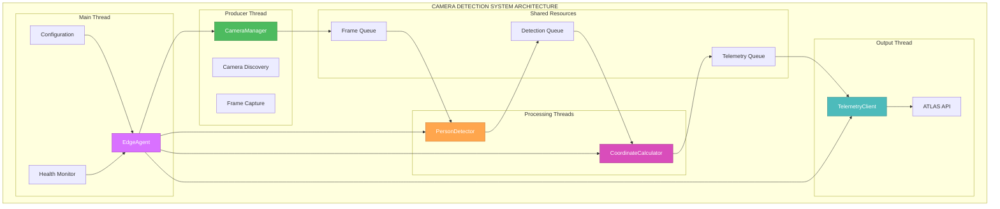

# 🎨🎨🎨 ENTERING CREATIVE PHASE: ARCHITECTURE DESIGN 🎨🎨🎨

## Component Description
The Camera Detection and Person Tracking System requires a robust architecture that can handle real-time video processing, person detection, coordinate calculations, and ATLAS telemetry integration on edge hardware (Raspberry Pi).

## Requirements & Constraints

### System Requirements:
- Automatic camera discovery and initialization
- Real-time person detection (>10 FPS)
- Bearing and elevation calculation from pixel coordinates
- ATLAS API telemetry integration
- Robust error handling and recovery
- Configurable camera parameters

### Technical Constraints:
- Must work on Raspberry Pi 4+ hardware
- Support both Pi Camera module and USB cameras
- Minimal CPU usage for edge deployment
- No internet dependency for core functionality
- Graceful degradation when cameras unavailable

## Multiple Architecture Options

### Option 1: Monolithic Pipeline Architecture
**Description**: Single-threaded sequential processing pipeline where each component processes data in order.

**Architecture**:
```
Camera → Detection → Calculation → Telemetry → Output
```

**Pros**:
- Simple to implement and debug
- Predictable execution flow
- Low memory overhead
- Easy error tracking

**Cons**:
- Blocking operations reduce throughput
- No parallelization benefits
- Camera frame drops during processing
- Single point of failure

**Technical Fit**: Medium
**Complexity**: Low
**Scalability**: Low

### Option 2: Multi-threaded Producer-Consumer Architecture
**Description**: Separate threads for camera capture, processing, and telemetry with shared queues.

**Architecture**:
```
Camera Thread → Frame Queue → Processing Thread → Result Queue → Telemetry Thread
```

**Pros**:
- Non-blocking camera capture
- Better CPU utilization
- Parallel processing capability
- Frame buffering prevents drops

**Cons**:
- Thread synchronization complexity
- Queue management overhead
- Potential race conditions
- Higher memory usage

**Technical Fit**: High
**Complexity**: Medium
**Scalability**: High

### Option 3: Event-Driven Async Architecture
**Description**: Async/await pattern with event-driven processing using asyncio.

**Architecture**:
```
Async Camera → Event Loop → Async Detection → Async Telemetry
```

**Pros**:
- Excellent I/O concurrency
- Low resource overhead
- Natural backpressure handling
- Modern Python patterns

**Cons**:
- Complex debugging
- Limited CPU-bound benefits
- Async ecosystem dependencies
- OpenCV/YOLO integration challenges

**Technical Fit**: Medium
**Complexity**: High
**Scalability**: Medium

### Option 4: Modular Service Architecture
**Description**: Independent service components with well-defined interfaces and dependency injection.

**Architecture**:
```
CameraService ↔ DetectionService ↔ CoordinateService ↔ TelemetryService
```

**Pros**:
- Highly testable components
- Clear separation of concerns
- Easy to extend/modify
- Excellent maintainability

**Cons**:
- Over-engineering for simple task
- Interface abstraction overhead
- More complex initialization
- Potential performance impact

**Technical Fit**: High
**Complexity**: High
**Scalability**: High

## Options Analysis

### Performance Comparison:
- **Option 1**: ~5-8 FPS (blocking operations)
- **Option 2**: ~15-20 FPS (parallel processing)
- **Option 3**: ~10-15 FPS (I/O optimized)
- **Option 4**: ~12-18 FPS (modular overhead)

### Resource Usage:
- **Option 1**: Lowest CPU, lowest memory
- **Option 2**: Medium CPU, medium memory
- **Option 3**: Low CPU, low memory
- **Option 4**: Medium CPU, medium memory

### Development Complexity:
- **Option 1**: 1-2 weeks
- **Option 2**: 2-3 weeks
- **Option 3**: 3-4 weeks
- **Option 4**: 3-4 weeks

## Recommended Approach

**Selected Option**: **Option 2 - Multi-threaded Producer-Consumer Architecture**

### Rationale:
1. **Performance**: Achieves target >10 FPS requirement with parallel processing
2. **Resource Efficiency**: Optimal balance of CPU/memory usage for edge hardware
3. **Reliability**: Frame buffering prevents camera drops during processing spikes
4. **Maintainability**: Clear thread boundaries with manageable complexity
5. **Scalability**: Can easily add more processing threads if needed

### Implementation Guidelines:

#### Core Components:
1. **CameraManager** (Producer Thread)
   - Handles camera discovery and initialization
   - Continuous frame capture to shared queue
   - Camera health monitoring and recovery

2. **PersonDetector** (Consumer Thread)
   - Processes frames from camera queue
   - YOLO inference and person filtering
   - Outputs detection results to coordinate queue

3. **CoordinateCalculator** (Consumer Thread)
   - Converts pixel coordinates to bearing/elevation
   - Applies camera calibration parameters
   - Outputs coordinate data to telemetry queue

4. **TelemetryClient** (Consumer Thread)
   - Formats data for ATLAS API
   - Handles network communication and retries
   - Manages local queuing during network outages

5. **EdgeAgent** (Main Thread)
   - Orchestrates all components
   - Handles configuration and logging
   - Monitors system health and performance

#### Thread Communication:
- **Frame Queue**: Camera → Detection (max 5 frames)
- **Detection Queue**: Detection → Coordinates (max 10 detections)
- **Telemetry Queue**: Coordinates → ATLAS (max 50 telemetry records)

#### Error Handling:
- Thread-safe error propagation
- Graceful degradation on component failures
- Automatic restart capabilities
- Health monitoring and alerting

## 🎨 CREATIVE CHECKPOINT: Architecture Selected

Architecture decision made: Multi-threaded Producer-Consumer with clear component boundaries and queue-based communication.

## Implementation Architecture Diagram



## Verification Against Requirements

### Requirements Met:
- ✅ Automatic camera discovery and initialization (CameraManager)
- ✅ Real-time person detection >10 FPS (Multi-threaded processing)
- ✅ Bearing and elevation calculation (CoordinateCalculator)
- ✅ ATLAS API telemetry integration (TelemetryClient)
- ✅ Robust error handling and recovery (Thread-safe error propagation)
- ✅ Configurable camera parameters (Configuration system)

### Technical Constraints Met:
- ✅ Raspberry Pi 4+ hardware support (Optimized thread count)
- ✅ Pi Camera and USB camera support (Abstracted camera interface)
- ✅ Minimal CPU usage (Efficient queue-based processing)
- ✅ No internet dependency for core functionality (Local processing)
- ✅ Graceful degradation (Component failure handling)

### Technical Feasibility: HIGH
- All components use proven technologies
- Threading model is well-understood
- Queue-based communication is reliable
- Error handling patterns are established

### Risk Assessment: LOW-MEDIUM
- **Low Risk**: Core processing logic, queue management
- **Medium Risk**: Thread synchronization, camera hardware compatibility
- **Mitigation**: Comprehensive testing, fallback mechanisms

🎨🎨🎨 EXITING CREATIVE PHASE - ARCHITECTURE DECISION MADE 🎨🎨🎨 